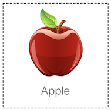
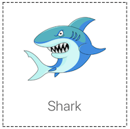
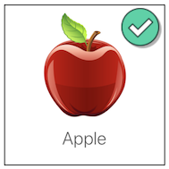
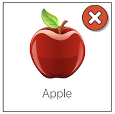
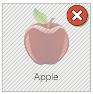
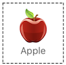

# ABChoiceView

[](https://travis-ci.com/avivbenshabat/ABChoiceView) [](https://github.com/Carthage/Carthage) [](/LICENSE) 
---
ABChoiceView is a Swift written, custom view library for iOS 9.1+</br>
ABChoiceView is very flexible and customable. It can be used in different sizes and shapes and every feature in it is modular.</br>

![alt text][default1]

By default, ChoiceView looks like this:</br>
 </br>
When Selected:</br>
</br>
You can change the check image, and add a mask:</br>
  </br>
Without image/text: </br>
 </br>
Different size: </br>


__Font, borders & mask are also customable__

## Installation

### CocoaPods

Add one of the following lines to your Podfile depending on your Swift version:

```
target 'MyApp' do
  pod 'ABChoiceView', '~> 1.0'
end
```

### Carthage

Add one of the following lines to your Cartfile depending on your Swift version:

```
github "avivbenshabat/ABChoiceView"
```

## Usage


[default1]: https://github.com/avivbenshabat/ABChoiceView/DemoImages/demo00.png "Default ChoiceView"